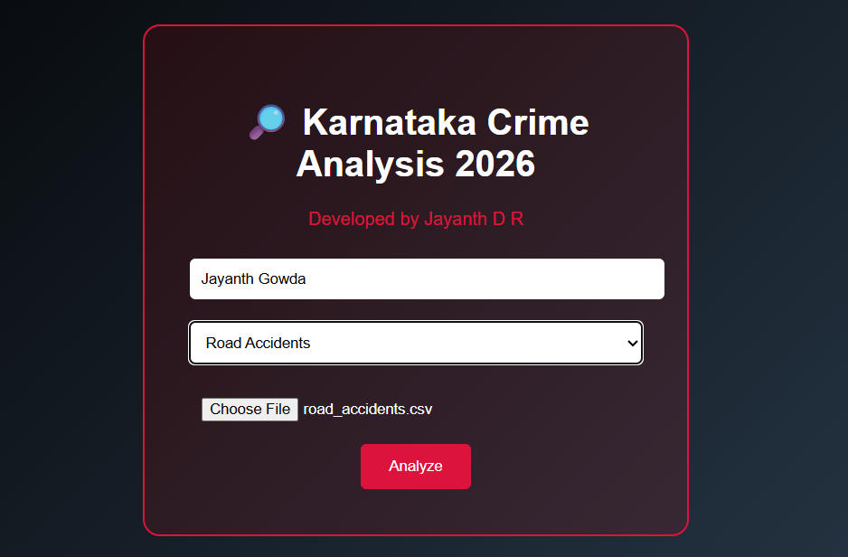
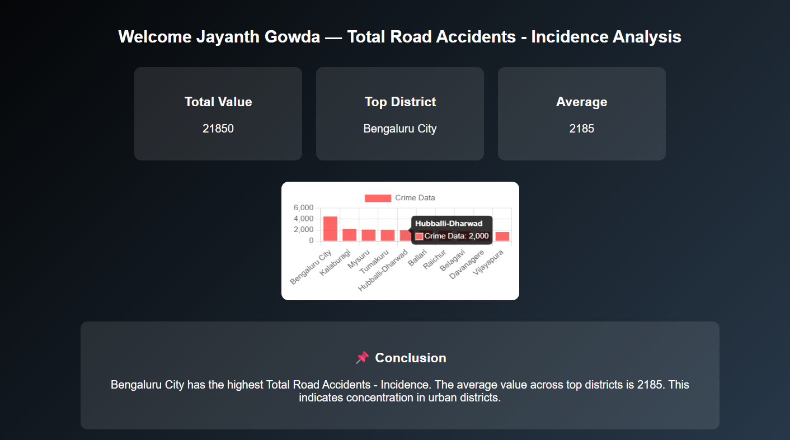

321# Karnataka Crime Analysis – Spring Boot Project
A full-stack Crime Data Analysis and Visualization system built using Java Spring Boot.  The application allows users to upload crime datasets (CSV), process district-wise statistics,  and generate interactive visual insights for Karnataka Crime 2023 analysis.

---
## 📌 Overview
This project is a Java Spring Boot based Crime Data Analysis system 
that processes CSV datasets and generates district-wise crime statistics 
and visual reports.
---
## 🚀 Features
- Upload CSV crime datasets
- Process district-wise crime records
- Analyze total crime, murder, road accidents
- REST API backend using Spring Boot
- Clean and responsive frontend UI
- Maven project structure
---
## 🛠 Tech Stack
- Java 17
- Spring Boot
- Maven
- HTML / CSS / JavaScript
- REST APIs
---
## 📊 Modules
- Crime Data Processing
- Road Accident Analysis
- Sexual Harassment Crime Analysis
- Total Crime Visualization
---
## Screenshots

### File Upload

### Analysis Result

---
## ▶ How to Run
1. Clone the repository
2. Open in IntelliJ IDEA
3. Run the Spring Boot Application
4. Access at: http://localhost:8080

## 👨‍💻 Author
**Jayanth D R**
